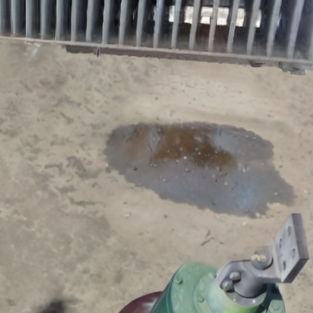
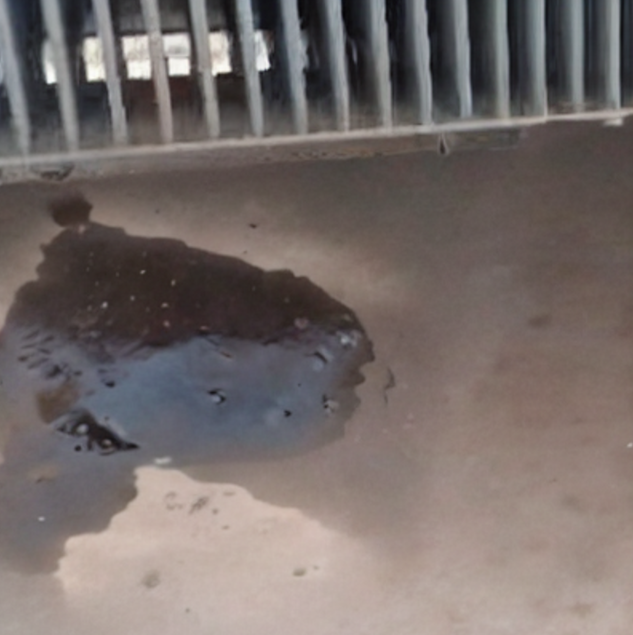
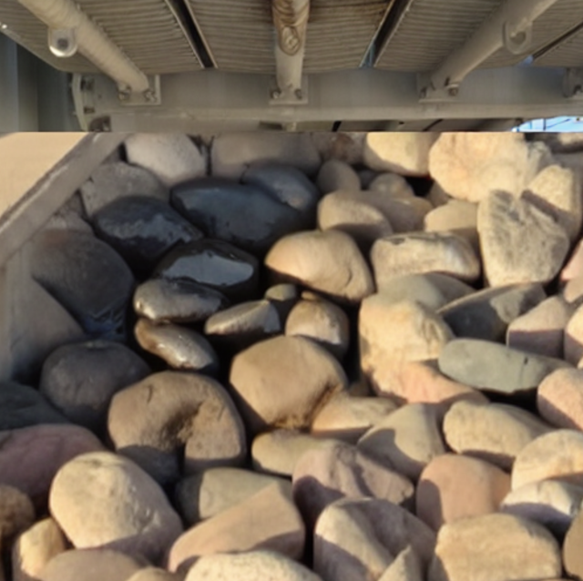
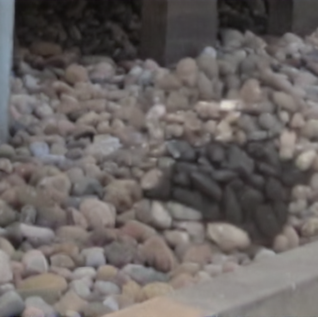

# AnoTGOL
AnoTGOL

 

---

## 📌 Abstract

To address the scarcity of power transformer ground oil leakage samples and the challenges existing generative models face in simultaneously achieving visual authenticity of anomalous images and high-precision annotation, this paper proposes AnoTGOL, a training-free generation and automatic annotation framework incorporating multimodal collaborative guidance and spatial prior intervention. This framework primarily consists of three core mechanisms working synergistically. First, a Multimodal Collaborative Guidance Mechanism is proposed to collaboratively guide image generation using multimodal information within the latent space. It aligns the features of real power transformer ground oil leakage textures with text token semantics, overcoming the guidance bias of a single modality and driving the diffusion models to generate high-fidelity oil leakage textures. Second, a Spatial Prior-Guided Attention Mechanism is designed, which leverages the physical law of power transformer ground oil leakage exhibiting Gaussian-like diffusion as a spatial prior to guide the attention, thereby precisely controlling the location and morphology of the generated oil leakage, and utilizing a dynamic mask fusion strategy to ensure a natural transition with the original background. Finally, an Attention-Prompt-Based Automatic Annotation Module is designed, which constructs a prompt map utilizing cross-attention maps and pixel discrepancy maps to provide high-confidence spatial prompts for downstream high-quality large segmentation models, thereby achieving the automatic generation of pixel-level masks. Extensive experiments in real-world scenarios demonstrate that the quality and diversity of images generated by AnoTGOL reach SOTA levels, and it can effectively enhance the performance of downstream anomaly detection tasks.

---

## 🖼️ Dataset Preview

Below are selected examples of the power transformer ground oil leakage images generated using the **AnoTGOL** framework:

  
  
  
  

## 💾 AnoTGOL-Dataset
Due to GitHub repository size limits, the full dataset package is hosted on external academic platforms. You can download Partial images generated using AnoTGOL via the following secure mirrors:

* **Zenodo (Recommended for Academic Citation):** [Download Link via Zenodo](https://doi.org/10.5281/zenodo.21333817)

* > ℹ️ **Status Update:** The complete dataset and source code are currently being organized and refined. We are working to make them available as soon as possible. Please **Star** this repository to stay updated on the latest releases!

